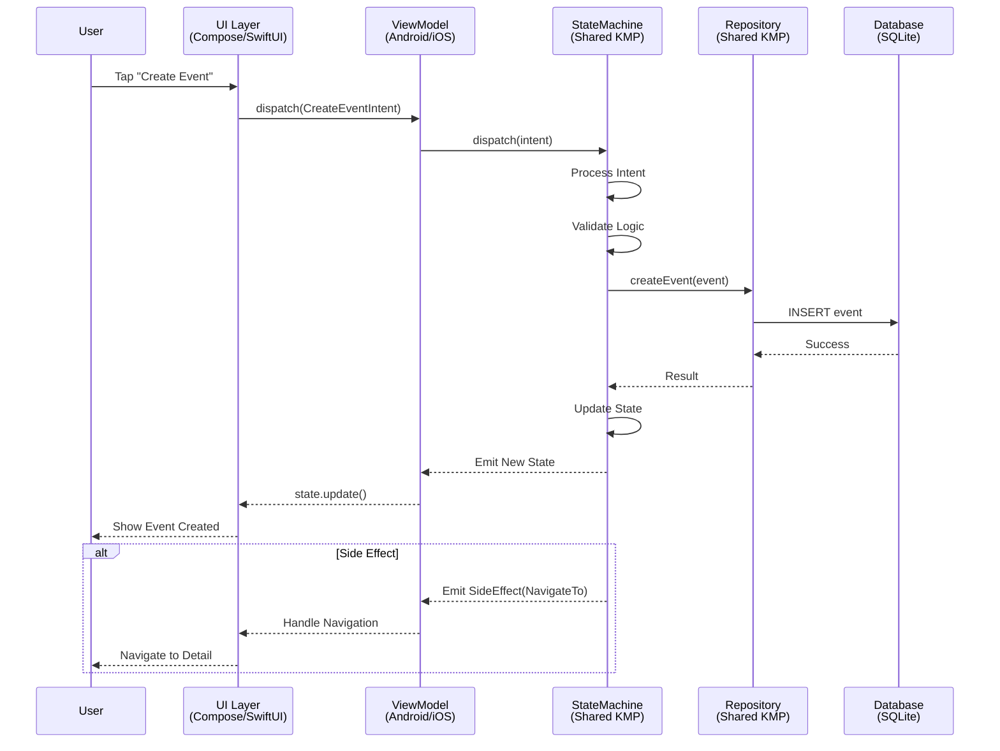
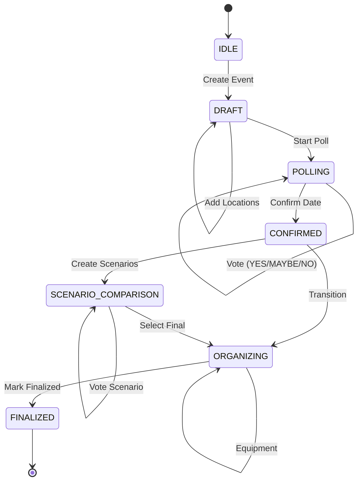
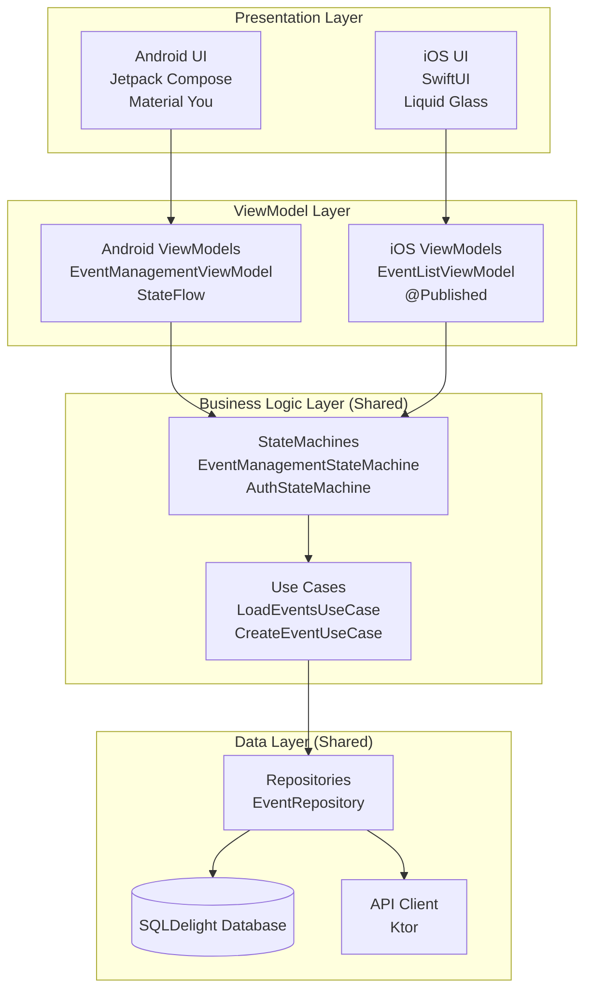
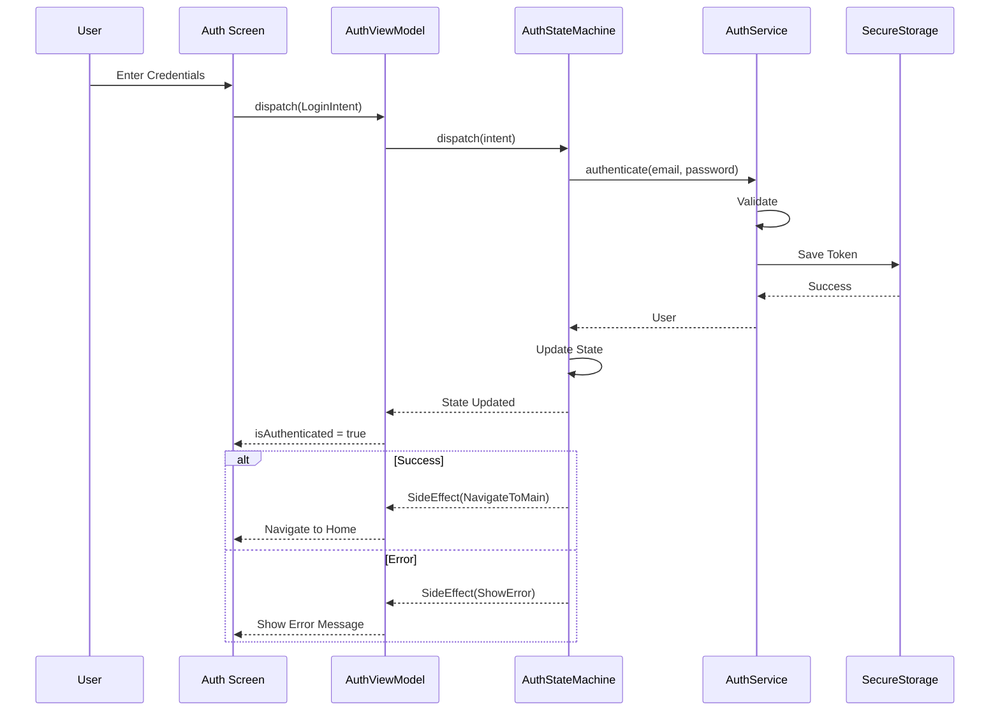
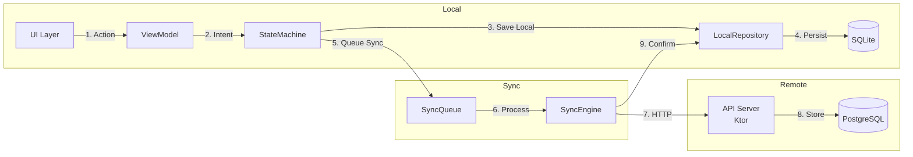
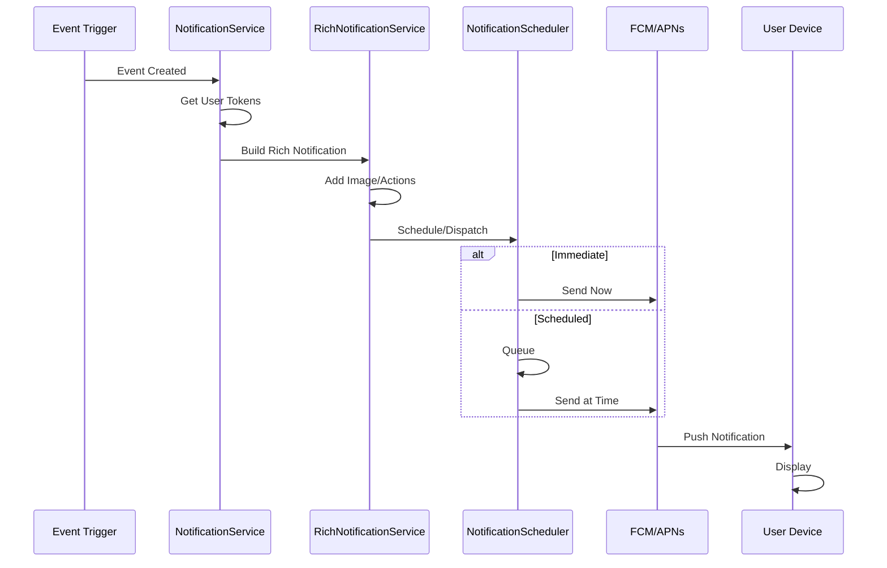
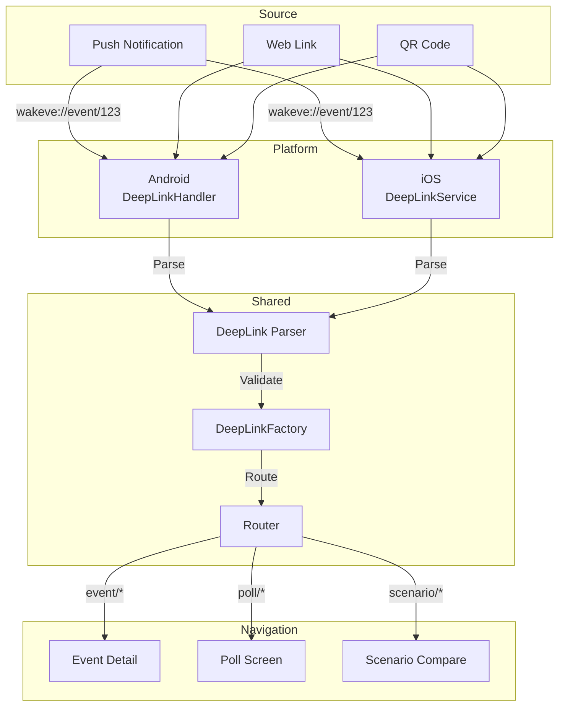
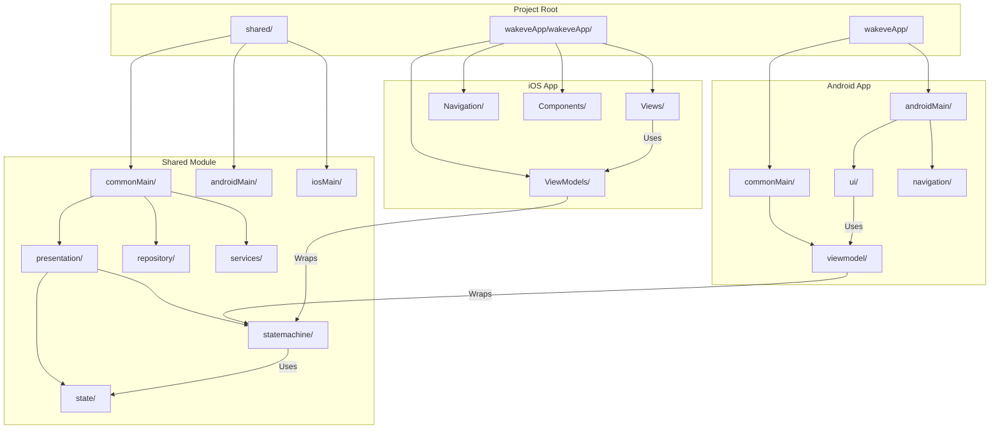
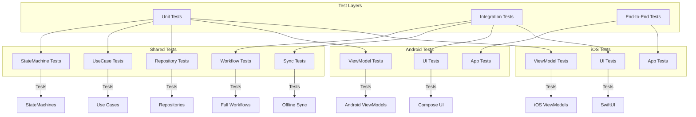
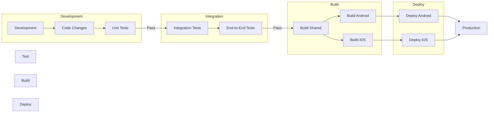

# Architecture Diagrams (Mermaid)

## Architecture Overview

```mermaid
graph TB
    subgraph "Shared (Kotlin Multiplatform)"
        SM[StateMachines<br/>EventManagementStateMachine<br/>AuthStateMachine<br/>ScenarioManagementStateMachine]
        CT[Contracts<br/>State / Intent / SideEffect]
        RP[Repositories<br/>EventRepository<br/>AuthRepository]
        DB[(SQLDelight<br/>SQLite Database)]
    end

    subgraph "Android (Jetpack Compose)"
        AV[ViewModels<br/>EventManagementViewModel<br/>AuthViewModel]
        AC[Compose Screens<br/>HomeScreen<br/>EventDetailScreen]
        AN[Navigation<br/>WakevNavHost]
    end

    subgraph "iOS (SwiftUI)"
        IV[ViewModels<br/>EventListViewModel<br/>ProfileViewModel]
        IS[SwiftUI Views<br/>EventListView<br/>EventDetailView]
        IN[Navigation<br/>AppNavigation]
    end

    SM -->|StateFlow| AV
    SM -->|@Published| IV
    AV -->|collectAsState| AC
    IV -->|@StateObject| IS
    AC -->|Intents| AV
    IS -->|dispatch| IV
    AV -->|dispatch| SM
    IV -->|dispatch| SM
    SM -->|Use Cases| RP
    RP -->|Queries| DB
```

## State Flow



## Event State Workflow



## Component Architecture



## Auth Flow



## Offline-First Sync



## Notification Flow



## Deep Link Handling



## Multi-Platform State Sharing

```mermaid
graph TB
    subgraph "Kotlin Multiplatform"
        direction TB
        SM[StateMachine]
        SF[StateFlow<State>]
        EF[Flow<SideEffect>]
        
        SM --> SF
        SM --> EF
    end

    subgraph "Android Bridge"
        direction TB
        AVM[ViewModel]
        ACS[collectAsState]
        AL[LaunchedEffect]
        
        AVM -->|wraps| SF
    end

    subgraph "iOS Bridge"
        direction TB
        IVM[ObservableObject]
        IOP[@Published]
        IOS[onStateChange]
        
        IVM -->|wraps| SF
    end

    subgraph "Android UI"
        AC[Compose<br/>@Composable]
    end

    subgraph "iOS UI"
        IS[SwiftUI<br/>View]
    end

    SF -->|StateFlow| AVM
    SF -->|ObservableStateMachine| IVM
    
    AVM -->|State| ACS
    ACS -->|state| AC
    
    IVM -->|@Published| IOP
    IOP -->|state| IS
    
    AC -->|Intent| AVM
    IS -->|Intent| IVM
    AVM -->|dispatch| SM
    IVM -->|dispatch| SM
```

## File Structure



## Testing Architecture



## Deployment Pipeline



## Legend

| Symbol | Meaning |
|--------|---------|
| ⭕ | Component/Module |
| 📦 | Package/Group |
| 🔄 | Flow/Process |
| 📱 | Platform-specific |
| 🔗 | Shared/Common |

---

*Generated for Wakeve Architecture Documentation*
