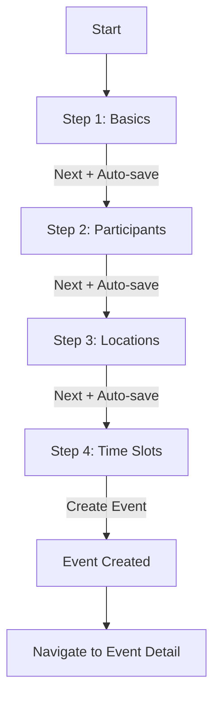

# Draft Event Wizard - UX & Implementation Guide

Ce document détaille le fonctionnement du wizard de création d'événement dans l'application Wakeve, introduit lors de la phase **Enhanced DRAFT**.

## 1. Overview

La création d'événement a été repensée comme un processus progressif en 4 étapes. Cette approche réduit la charge cognitive de l'utilisateur en segmentant la saisie des données et permet une sauvegarde automatique robuste à chaque transition d'étape.

### Objectifs Clés
- **Simplicité** : Un seul concept par écran.
- **Flexibilité** : Support des créneaux horaires flous (ex: "un après-midi") et des estimations de participants.
- **Sécurité** : Sauvegarde automatique pour ne jamais perdre de progression.
- **Consistance** : Même workflow sur Android (Material You) et iOS (Liquid Glass).

## 2. User Flow

Le diagramme suivant illustre le parcours de l'organisateur lors de la création d'un événement en status `DRAFT`.



## 3. Step-by-Step Documentation

### Step 1: Basics (Informations de base)

Cette étape recueille l'identité fondamentale de l'événement.

**Champs :**
- **Title** : Titre court et explicite (ex: "Séminaire d'été").
- **Description** : Détails sur l'objectif ou le contexte.
- **Event Type** : Catégorisation pour aider les agents (Suggestions, Destination).

**Comportement :**
- **Sélecteur de type** : Liste de presets (BIRTHDAY, WEDDING, TEAM_BUILDING, etc.).
- **Custom Type** : Si "CUSTOM" est sélectionné, un champ texte additionnel apparaît.

**Validation :**
- `title` ne doit pas être vide.
- `description` ne doit pas être vide.
- Si `eventType` est `CUSTOM`, le champ `eventTypeCustom` est obligatoire.

**Exemple UI :**
```text
┌─────────────────────────────────────┐
│  Create Event        Step 1 of 4   │
├─────────────────────────────────────┤
│                                     │
│  Event Title *                      │
│  ┌─────────────────────────────┐   │
│  │ Séminaire d'équipe         │   │
│  └─────────────────────────────┘   │
│                                     │
│  Description *                      │
│  ┌─────────────────────────────┐   │
│  │ Retrait annuel de l'équipe │   │
│  └─────────────────────────────┘   │
│                                     │
│  Event Type                         │
│  ┌─────────────────────────────┐   │
│  │ TEAM_BUILDING           ▼ │   │
│  └─────────────────────────────┘   │
│                                     │
│  [Cancel]               [Next →]     │
└─────────────────────────────────────┘
```

---

### Step 2: Participants (Estimation)

Permet de dimensionner l'événement pour que les agents puissent proposer des lieux ou des budgets adaptés.

**Champs :**
- **Expected Participants** : Nombre cible.
- **Min Participants** : Seuil minimal pour que l'événement ait lieu.
- **Max Participants** : Capacité maximale.

**Comportement :**
- Tous les champs sont optionnels.
- L'utilisateur peut saisir uniquement le nombre attendu ou une fourchette.

**Validation :**
- Tous les nombres doivent être positifs (> 0).
- Si `min` et `max` sont tous deux fournis, on doit avoir `max >= min`.

**Exemple UI :**
```text
┌─────────────────────────────────────┐
│  Create Event        Step 2 of 4   │
├─────────────────────────────────────┤
│                                     │
│  Expected Participants               │
│  ┌─────────────────────────────┐   │
│  │ 20                        │   │
│  └─────────────────────────────┘   │
│                                     │
│  Min Participants (optional)         │
│  ┌─────────────────────────────┐   │
│  │ 15                        │   │
│  └─────────────────────────────┘   │
│                                     │
│  Max Participants (optional)         │
│  ┌─────────────────────────────┐   │
│  │ 25                        │   │
│  └─────────────────────────────┘   │
│                                     │
│  Estimation: 15-25 people (exp: 20) │
│                                     │
│  [← Previous]           [Next →]     │
└─────────────────────────────────────┘
```

---

### Step 3: Locations (Lieux potentiels)

L'organisateur peut lister des lieux qu'il envisage. Ces lieux serviront de base à la création de scénarios plus tard.

**Actions :**
- **Ajouter un lieu** : Ouvre un dialogue/sheet.
- **Types de lieux** : CITY, REGION, SPECIFIC_VENUE, ONLINE.
- **Supprimer** : Retirer une option de la liste.

**Comportement :**
- Liste optionnelle (0 ou plusieurs lieux).
- Les lieux ne peuvent être ajoutés/supprimés qu'en phase `DRAFT`.

**Validation :**
- Nom du lieu obligatoire.
- Type de lieu obligatoire.

**Exemple UI :**
```text
┌─────────────────────────────────────┐
│  Create Event        Step 3 of 4   │
├─────────────────────────────────────┤
│                                     │
│  Potential Locations                 │
│  ┌─────────────────────────────┐   │
│  │ 🏙️ Paris (CITY)          [×] │
│  └─────────────────────────────┘   │
│  ┌─────────────────────────────┐   │
│  │ 🏛️ Berlin (CITY)         [×] │
│  └─────────────────────────────┘   │
│                                     │
│            [+ Add Location]           │
│                                     │
│  [← Previous]           [Next →]     │
└─────────────────────────────────────┘
```

---

### Step 4: Time Slots (Créneaux horaires)

C'est l'étape la plus critique. L'organisateur propose des dates sur lesquelles les participants voteront.

**Champs :**
- **Date** : Le jour concerné.
- **Time of Day** : ALL_DAY, MORNING, AFTERNOON, EVENING, SPECIFIC.
- **Start/End Times** : Obligatoires uniquement si le type est `SPECIFIC`.

**Comportement :**
- Au moins **un créneau** est requis pour finaliser la création.
- Support des créneaux flexibles : "Après-midi" sans préciser l'heure.

**Validation :**
- `timeSlots` non vide.
- Si `SPECIFIC`, alors `start` et `end` ne doivent pas être null.

**Exemple UI :**
```text
┌─────────────────────────────────────┐
│  Create Event        Step 4 of 4   │
├─────────────────────────────────────┤
│                                     │
│  Time Slots (at least 1)           │
│  ┌─────────────────────────────┐   │
│  │ Jun 15, 2025              [×] │
│  │ Afternoon                     │
│  └─────────────────────────────┘   │
│  ┌─────────────────────────────┐   │
│  │ Jun 16, 2025              [×] │
│  │ 14:00 - 18:00 (Specific)     │
│  └─────────────────────────────┘   │
│                                     │
│           [+ Add Time Slot]           │
│                                     │
│  [← Previous]        [Create Event] │
└─────────────────────────────────────┘
```

## 4. Auto-Save Behavior

Le wizard implémente une stratégie de sauvegarde automatique agressive :
1. **State Management** : Toutes les modifications sont stockées dans le state local du wizard.
2. **Transition Save** : Lors d'un clic sur "Next", les données actuelles sont envoyées au repository (`onSaveStep`).
3. **Persistance Locale** : Le repository synchronise avec la base de données SQLDelight locale immédiatement.
4. **Reprise** : Si l'utilisateur quitte le wizard, l'événement reste en status `DRAFT` et pourra être complété plus tard depuis la liste des événements.

## 5. Validation Summary

| Step | Field | Required | Validation Rule |
|------|-------|----------|-----------------|
| 1 | Title | Oui | `isNotBlank()` |
| 1 | Description | Oui | `isNotBlank()` |
| 1 | Event Type | Non | Si CUSTOM, `eventTypeCustom` obligatoire |
| 2 | Expected | Non | `val > 0` |
| 2 | Min | Non | `val > 0` |
| 2 | Max | Non | `val > 0` AND `val >= min` |
| 3 | Locations | Non | Nom obligatoire si ajouté |
| 4 | Time Slots | **Oui** | `list.isNotEmpty()` |

## 6. Design System Guidelines

### Android (Material You)
- **Top Bar** : Titre centré avec bouton retour.
- **Progress** : `LinearProgressIndicator` en haut de la barre de navigation basse.
- **Champs** : `OutlinedTextField` avec labels flottants.
- **Animations** : `AnimatedContent` avec transition horizontale lors des changements d'étapes.

### iOS (Liquid Glass)
- **Sheet Navigation** : Le wizard est généralement présenté dans un modal/sheet.
- **Style** : Grouped Lists pour les formulaires.
- **Boutons** : `LiquidGlassCard` style ou boutons arrondis avec glassmorphism.
- **Haptics** : Feedback tactile lors de la validation réussie d'une étape.

## 7. Accessibility

- **Focus Management** : Le focus se déplace automatiquement vers le haut de la page lors du changement d'étape.
- **Labels** : Chaque champ a un label descriptif pour TalkBack/VoiceOver.
- **Annonces** : "Étape X sur 4" est annoncé lors de la navigation.
- **Erreurs** : Les messages d'erreur de validation sont lus immédiatement par le lecteur d'écran.

## 8. Developer Tips

### Tester le Wizard
- Utilisez `DraftPhaseIntegrationTest` pour vérifier la logique métier sans UI.
- Sur Android, utilisez `DraftEventWizardPreview` pour tester visuellement les steps.
- Sur iOS, utilisez les `Previews` SwiftUI avec différents `initialEvent`.

### Ajouter un champ
1. Mettre à jour le modèle `Event` dans `shared`.
2. Ajouter le champ dans le state de `DraftEventWizard.kt` (Android) et `DraftEventWizardView.swift` (iOS).
3. Mettre à jour la fonction `buildEvent()` dans les deux fichiers.
4. Ajouter l'UI correspondante dans la step appropriée.

### Modifier l'ordre des steps
- Modifiez la liste `steps` et le bloc `when(currentStep)` dans les implémentations UI.
- Attention à mettre à jour les règles de validation pour qu'elles correspondent au nouvel index.

## 9. Screenshots (Placeholder)

```text
TODO: Ajouter les captures d'écran finales pour :
- Step 1: Basics (Android + iOS)
- Step 2: Participants (Android + iOS)
- Step 3: Locations (Android + iOS)
- Step 4: Time Slots (Android + iOS)
- Exemples d'erreurs de validation
```
