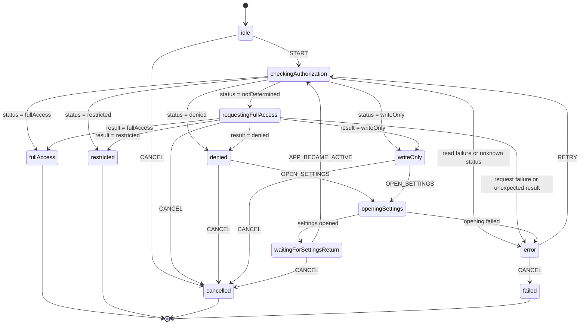

# iOS Calendar Permission Model Review

Status: MODEL REVIEWED — production implementation intentionally remains RED.

Source of truth: `models/calendar-permission/calendarPermission.machine.ts`.

## Scope and evidence

Wakeve reads, creates, updates, and deletes EventKit events, so write-only access is insufficient. The app target resolves to iOS 18.2. Apple introduced full calendar access in iOS 17 and deprecates `requestAccessToEntityType` from iOS 17 in favor of `requestFullAccessToEventsWithCompletion`. The Kotlin/Native binding exposes that selector as `requestFullAccessToEventsWithCompletion`.

The existing `calendar-management` specification already requires native calendar integration. This is a compatibility bugfix that restores the specified behavior, so no additional OpenSpec proposal is required for this RED phase.

Authoritative references:

- https://developer.apple.com/documentation/eventkit/ekeventstore/requestfullaccesstoevents(completion:)
- https://developer.apple.com/documentation/eventkit/accessing-the-event-store
- Local Xcode SDK: `EventKit.framework/Headers/EKEventStore.h`

## State model

## States and effects

| State | Meaning | Allowed effects |
| --- | --- | --- |
| `idle` | No permission work has started. | None. |
| `checkingAuthorization` | Read the current EventKit authorization status. | Invoke `readAuthorizationStatus` once. |
| `requestingFullAccess` | The current status is `notDetermined`. | Invoke `requestFullAccessToEvents` once. This is the only state allowed to display the system prompt. |
| `denied` | Full access was denied. | Emit denied guidance; allow Settings or cancellation. Never prompt again. |
| `writeOnly` | EventKit allows creation but not the reads required by Wakeve update/delete flows. | Emit full-access-required guidance; allow Settings or cancellation. |
| `openingSettings` | The user explicitly chose to repair permission. | Open application Settings once. |
| `waitingForSettingsReturn` | Settings was opened successfully. | Emit waiting guidance; wait for app activation before rechecking. |
| `error` | Status read, permission request, or Settings launch failed. | Emit retryable error; allow deterministic retry or terminal failure. |
| `fullAccess` | Read/write access is confirmed. | Emit permission granted. Terminal success. |
| `restricted` | Device policy or parental controls prevent access. | Emit restricted guidance. Terminal non-success. |
| `cancelled` | The user cancelled before access was confirmed. | None. Terminal non-success. |
| `failed` | A retryable error was explicitly abandoned. | Emit terminal failure. Terminal non-success. |

## Events and transitions

External events are `START`, `OPEN_SETTINGS`, `APP_BECAME_ACTIVE`, `RETRY`, and `CANCEL`. Actor completion/error events are generated by XState and are accepted only by the state that invoked the actor:

- `read-calendar-authorization-status` resolves to exactly one authorization status or rejects.
- `request-full-calendar-access` resolves to exactly one authorization status or rejects.
- `open-calendar-settings` resolves only after the Settings URL is accepted, or rejects.

No free-form text is parsed to choose a transition.

## Scenario review

### Nominal: already authorized

`START → checkingAuthorization → fullAccess`. No system prompt appears. The pending calendar operation may continue only after the terminal granted signal.

### Nominal: first request

`START → checkingAuthorization(notDetermined) → requestingFullAccess(fullAccess) → fullAccess`. The iOS 17+ full-access API is invoked exactly once.

### Denied

Both a pre-existing denial and denial from the prompt enter `denied`. A repeated system prompt is forbidden. The user can cancel or explicitly open Settings.

### Restricted

`restricted` is terminal because the app cannot override device policy or parental controls. It never opens Settings automatically and never treats restriction as denial or success.

### Write-only

`writeOnly` is insufficient because Wakeve searches existing events before update/delete. It follows the same explicit Settings repair path as denial, without showing another system prompt.

### Retry through Settings

`denied|writeOnly → openingSettings → waitingForSettingsReturn → checkingAuthorization`. Returning to the app triggers a fresh EventKit status read; the model never assumes that Settings changed the permission.

### Error and retry

Read, request, and Settings-launch failures enter `error` with a normalized error. `RETRY` restarts status observation. `CANCEL` ends in `failed`. An unexpected or still-`notDetermined` result after a completed prompt is an error, never implicit success.

### Cancellation and terminal states

The user can cancel before starting, while the system request is pending, while denied/write-only, or while waiting for Settings return. Terminal states are `fullAccess`, `restricted`, `cancelled`, and `failed`; only `fullAccess` is successful.

## Invariants

1. Only `fullAccess` may emit `CALENDAR_PERMISSION_GRANTED`.
2. No add, read, update, or delete EventKit operation may execute before `fullAccess`.
3. Only `notDetermined` may transition to `requestingFullAccess` and invoke the system prompt.
4. For the iOS 18.2 target, the prompt actor must use `requestFullAccessToEventsWithCompletion`; `requestAccessToEntityType` is forbidden.
5. The effective app configuration must contain a non-empty `NSCalendarsFullAccessUsageDescription` before requesting full access.
6. `denied`, `restricted`, and `writeOnly` are never coerced to success.
7. `denied` and `writeOnly` retry only through explicit Settings navigation followed by a fresh status read.
8. `restricted` is terminal and cannot invoke Settings or the permission prompt.
9. At most one permission/status/Settings actor is in flight because every actor is state-bound.
10. Actor errors and unknown statuses enter `error`; they never fall through to a calendar mutation.
11. UI text and LLM output are signals only. No LLM participates in guards, events, authorization status, or transitions.
12. A new calendar operation starts a new machine actor; terminal snapshots are not mutated or reused as authorization truth.

## Review verdict

- Nominal authorized and first-prompt paths: covered.
- `notDetermined`, `denied`, `restricted`, `fullAccess`, and `writeOnly`: covered explicitly.
- Read/request/Settings errors: covered with retry and terminal abandonment.
- Cancellation: covered before and during recoverable states.
- Retry via Settings: covered without assuming success.
- Terminal states and invariants: explicit and deterministic.
- LLM boundary: compliant; the model alone decides transitions.

The model is approved for the subsequent implementation phase. Production remains intentionally unchanged until the RED contract is reviewed.
