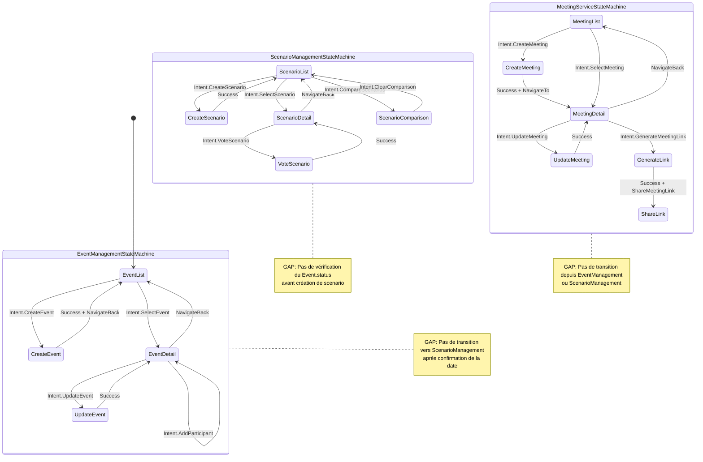

# Audit des Transitions State Machines - Workflow Wakeve

> **Change ID**: `verify-statemachine-workflow`  
> **Phase**: Phase 1 - Audit  
> **Date**: 2025-12-31  

---

## 📊 Vue d'ensemble

Cet audit analyse les **3 state machines** principales de Wakeve pour identifier les transitions, gaps, et dépendances dans le workflow utilisateur.

---

## 🎯 State Machines Analysées

### 1. EventManagementStateMachine
**Responsabilité** : Gestion du cycle de vie des événements (DRAFT → POLLING → CONFIRMED)

### 2. ScenarioManagementStateMachine
**Responsabilité** : Comparaison et vote sur scénarios (SCENARIO_COMPARISON)

### 3. MeetingServiceStateMachine
**Responsabilité** : Création de réunions virtuelles (ORGANIZATION)

---

## 🔄 Diagramme de Workflow Actuel



---

## 📋 Inventaire des Intents par State Machine

### EventManagementStateMachine

| Intent | Déclenche | Side Effect | Note |
|--------|-----------|-------------|------|
| `LoadEvents` | Charge liste événements | - | Initial load |
| `SelectEvent` | Sélectionne événement | `NavigateTo("detail/$id")` | ✅ |
| `CreateEvent` | Crée événement | `ShowToast` + `NavigateBack` | ✅ |
| `UpdateEvent` | Met à jour événement | `ShowToast` | ✅ |
| `DeleteEvent` | Supprime événement | - | ⚠️ TODO |
| `LoadParticipants` | Charge participants | - | Internal |
| `AddParticipant` | Ajoute participant | `ShowToast` | ✅ |
| `LoadPollResults` | Charge résultats poll | - | Internal |
| `ClearError` | Efface erreur | - | ✅ |

**🔴 Gap identifié** : Aucun Intent pour "ConfirmDate" qui devrait déclencher transition vers CONFIRMED et navigation vers ScenarioManagement.

---

### ScenarioManagementStateMachine

| Intent | Déclenche | Side Effect | Note |
|--------|-----------|-------------|------|
| `LoadScenarios` | Charge scenarios (legacy) | - | Utilise eventId du state |
| `LoadScenariosForEvent` | Charge scenarios pour event | - | ✅ Preferred |
| `CreateScenario` | Crée scenario | `ShowToast` | ✅ |
| `SelectScenario` | Sélectionne scenario | `NavigateTo("scenario/$id")` | ✅ |
| `UpdateScenario` | Met à jour scenario | `ShowToast` | ✅ |
| `DeleteScenario` | Supprime scenario | `ShowToast` + `NavigateBack` | ✅ |
| `VoteScenario` | Vote sur scenario | `ShowToast` | ✅ |
| `CompareScenarios` | Compare scenarios | `NavigateTo("scenarios/compare")` | ✅ |
| `ClearComparison` | Quitte comparaison | - | ✅ |
| `ClearError` | Efface erreur | - | ✅ |

**🔴 Gap identifié** : Aucune validation du `Event.status` avant `CreateScenario` (devrait bloquer si status != CONFIRMED).

**🔴 Gap identifié** : Aucun Intent pour "SelectScenarioAsFinal" qui devrait mettre à jour l'événement et déclencher transition vers ORGANIZATION.

---

### MeetingServiceStateMachine

| Intent | Déclenche | Side Effect | Note |
|--------|-----------|-------------|------|
| `LoadMeetings` | Charge réunions | - | ✅ |
| `CreateMeeting` | Crée réunion | `ShowToast` + `NavigateTo("meeting/$id")` | ✅ |
| `UpdateMeeting` | Met à jour réunion | `ShowToast` | ✅ |
| `CancelMeeting` | Annule réunion | `ShowToast` + `NavigateBack` | ✅ |
| `GenerateMeetingLink` | Génère lien | `ShareMeetingLink` | ✅ |
| `SelectMeeting` | Sélectionne réunion | `NavigateTo("meeting/$id")` | ✅ |
| `ClearGeneratedLink` | Efface lien généré | - | ✅ |
| `ClearError` | Efface erreur | - | ✅ |

**🔴 Gap identifié** : Aucune validation du `Event.status` avant `CreateMeeting` (devrait bloquer si status != CONFIRMED).

---

## 🚨 Gaps Critiques Identifiés

### 1. **Pas de transition EventManagement → ScenarioManagement**

**Problème** : Après confirmation de la date (status → CONFIRMED), rien ne déclenche l'ouverture de ScenarioManagement.

**Impact** : L'utilisateur doit naviguer manuellement, pas de workflow fluide.

**Solution proposée** :
```kotlin
// Dans EventManagementStateMachine
suspend fun confirmDate(slotId: String) {
    val updatedEvent = currentState.selectedEvent?.copy(
        status = EventStatus.CONFIRMED,
        finalDate = slotId
    )
    
    eventRepository.updateEvent(updatedEvent)
    
    // Émettre navigation vers scenarios
    emitSideEffect(SideEffect.NavigateTo("scenarios/${updatedEvent.id}"))
}
```

---

### 2. **Pas de validation du Event.status dans ScenarioManagement**

**Problème** : On peut créer des scenarios même si l'événement est en DRAFT (invalide selon les specs).

**Impact** : Violation des invariants métier, données incohérentes.

**Solution proposée** :
```kotlin
// Dans ScenarioManagementStateMachine
private suspend fun handleCreateScenario(intent: Intent.CreateScenario) {
    // Valider le status de l'événement
    val event = eventRepository.getEvent(intent.scenario.eventId)
    
    if (event.status != EventStatus.CONFIRMED) {
        emitSideEffect(SideEffect.ShowError(
            "Scenarios can only be created after confirming the date"
        ))
        return
    }
    
    // Continuer avec la création...
}
```

---

### 3. **Pas de transition ScenarioManagement → MeetingService**

**Problème** : Après sélection d'un scenario final, rien ne déclenche l'accès aux meetings.

**Impact** : L'utilisateur ne peut pas créer de réunions après avoir finalisé le scenario.

**Solution proposée** :
```kotlin
// Dans ScenarioManagementStateMachine - nouvel Intent
is Intent.SelectScenarioAsFinal -> {
    val updatedEvent = currentState.eventId.let { eventId ->
        eventRepository.getEvent(eventId).copy(
            status = EventStatus.ORGANIZATION,
            selectedScenarioId = intent.scenarioId
        )
    }
    
    eventRepository.updateEvent(updatedEvent)
    
    // Émettre navigation vers meetings
    emitSideEffect(SideEffect.NavigateTo("meetings/${updatedEvent.id}"))
}
```

---

### 4. **Pas de validation du Event.status dans MeetingService**

**Problème** : On peut créer des meetings même si l'événement n'est pas en ORGANIZATION.

**Impact** : Violation des invariants métier.

**Solution proposée** :
```kotlin
// Dans MeetingServiceStateMachine
private suspend fun handleCreateMeeting(intent: Intent.CreateMeeting) {
    // Valider le status de l'événement
    val event = eventRepository.getEvent(currentState.eventId)
    
    if (event.status != EventStatus.CONFIRMED && 
        event.status != EventStatus.ORGANIZATION) {
        emitSideEffect(SideEffect.ShowError(
            "Meetings can only be created after confirming the date"
        ))
        return
    }
    
    // Continuer avec la création...
}
```

---

### 5. **Pas d'observation du Event.status**

**Problème** : Les state machines ne réagissent pas automatiquement aux changements de status.

**Impact** : Les fonctionnalités ne se déverrouillent pas automatiquement.

**Solution proposée** :
```kotlin
// Dans chaque StateMachine - init block
init {
    scope.launch {
        eventRepository.getEvent(eventId).collect { event ->
            when (event.status) {
                EventStatus.CONFIRMED -> {
                    updateState { it.copy(scenariosUnlocked = true) }
                }
                EventStatus.ORGANIZATION -> {
                    updateState { it.copy(meetingsUnlocked = true) }
                }
                // ...
            }
        }
    }
}
```

---

### 6. **Pas de gestion de l'ordre offline**

**Problème** : Si on fait "create event → add participant → start poll" offline, rien ne garantit l'ordre.

**Impact** : Les actions peuvent s'exécuter dans le mauvais ordre à la reconnexion.

**Solution proposée** :
- Implémenter une `OfflineActionQueue` avec dépendances
- Chaque action a un `dependsOn: ActionId?`
- À la reconnexion, exécuter dans l'ordre topologique

---

## 🔗 Dépendances entre State Machines

### EventRepository - Point central

**Actuellement** :
- EventManagementStateMachine : Accès direct via `eventRepository?` (nullable)
- ScenarioManagementStateMachine : Pas d'accès direct (utilise UseCases uniquement)
- MeetingServiceStateMachine : Pas d'accès direct (utilise UseCases uniquement)

**🔴 Problème** : Aucune communication entre state machines, elles ne se "voient" pas.

**✅ Solution** : Chaque state machine devrait observer le repository pour détecter les changements d'état.

---

## 📊 Matrice de Communication Actuelle

|  | EventManagement | ScenarioManagement | MeetingService |
|---|---|---|---|
| **EventManagement** | - | ❌ Aucune | ❌ Aucune |
| **ScenarioManagement** | ❌ Aucune | - | ❌ Aucune |
| **MeetingService** | ❌ Aucune | ❌ Aucune | - |

**Verdict** : 🔴 **Les state machines sont totalement isolées** - aucune communication inter-machines.

---

## 🎯 Workflow Attendu vs Réel

### Workflow Attendu (selon specs)

```
1. DRAFT        → EventManagement (créer, ajouter participants)
2. POLLING      → EventManagement (vote sur créneaux)
3. CONFIRMED    → EventManagement (confirmer date)
   ↓ [TRANSITION MANQUANTE]
4. SCENARIO     → ScenarioManagement (créer, comparer, voter)
5. CONFIRMED    → ScenarioManagement (sélectionner scenario final)
   ↓ [TRANSITION MANQUANTE]
6. ORGANIZATION → MeetingService (créer réunions)
7. FINALIZED    → Tous les détails confirmés
```

### Workflow Réel (actuel)

```
1. DRAFT        → EventManagement ✅
2. POLLING      → EventManagement ✅
3. CONFIRMED    → EventManagement ✅
   ↓ ❌ AUCUNE TRANSITION
4. ???          → ScenarioManagement (accessible manuellement)
5. ???          → ScenarioManagement (pas de sélection finale)
   ↓ ❌ AUCUNE TRANSITION
6. ???          → MeetingService (accessible manuellement)
7. FINALIZED    → ❌ Jamais atteint
```

---

## 🔧 Side Effects de Navigation

### EventManagementStateMachine

| Side Effect | Route | Déclenché par | État requis |
|-------------|-------|---------------|-------------|
| `NavigateTo("detail/$id")` | EventDetail | SelectEvent | ✅ Aucun |
| `NavigateBack` | EventList | CreateEvent success | ✅ Aucun |

**🔴 Manquant** : `NavigateTo("scenarios/$id")` après confirmation date.

---

### ScenarioManagementStateMachine

| Side Effect | Route | Déclenché par | État requis |
|-------------|-------|---------------|-------------|
| `NavigateTo("scenario/$id")` | ScenarioDetail | SelectScenario | ✅ Aucun |
| `NavigateTo("scenarios/compare")` | ScenarioComparison | CompareScenarios | ✅ Aucun |
| `NavigateBack` | ScenarioList | DeleteScenario success | ✅ Aucun |

**🔴 Manquant** : `NavigateTo("meetings/$id")` après sélection scenario final.

---

### MeetingServiceStateMachine

| Side Effect | Route | Déclenché par | État requis |
|-------------|-------|---------------|-------------|
| `NavigateTo("meeting/$id")` | MeetingDetail | CreateMeeting success | ✅ Aucun |
| `NavigateTo("meeting/$id")` | MeetingDetail | SelectMeeting | ✅ Aucun |
| `NavigateBack` | MeetingList | CancelMeeting success | ✅ Aucun |
| `ShareMeetingLink(url)` | Share sheet | GenerateMeetingLink | ✅ Aucun |

**✅ OK** : Navigation MeetingService semble cohérente.

---

## 🚦 Validation des Invariants

| Invariant | Validé ? | État actuel |
|-----------|----------|-------------|
| 1. Ordre des phases DRAFT → POLLING → CONFIRMED → ORGANIZATION → FINALIZED | ❌ | Pas d'enforcement |
| 2. Pas de retour arrière (CONFIRMED → POLLING) | ❌ | Pas de validation |
| 3. Scenarios après CONFIRMED uniquement | ❌ | Aucune validation |
| 4. Meetings après CONFIRMED uniquement | ❌ | Aucune validation |
| 5. Votes impossibles après deadline ou CONFIRMED | ❌ | Pas implémenté |
| 6. Actions organisateur uniquement (confirm, select) | ⚠️ | À vérifier |
| 7. Au moins un vote avant confirmation | ❌ | Pas validé |

**Verdict** : 🔴 **0/7 invariants garantis** - Aucune validation dans les state machines.

---

## 📝 Résumé des Gaps

### Gaps Critiques (Bloquants)

1. ✅ **Pas de transition EventManagement → ScenarioManagement** après confirmation date
2. ✅ **Pas de transition ScenarioManagement → MeetingService** après sélection scenario
3. ✅ **Aucune communication entre state machines** (isolation totale)
4. ✅ **Aucune observation du Event.status** (pas de réactivité)

### Gaps Majeurs (Importants)

5. ✅ **Pas de validation des invariants** (scenarios en DRAFT, meetings sans confirmation)
6. ✅ **Pas de gestion de l'ordre offline** (actions peuvent s'exécuter dans le désordre)
7. ✅ **Pas d'Intent ConfirmDate** dans EventManagement
8. ✅ **Pas d'Intent SelectScenarioAsFinal** dans ScenarioManagement

### Gaps Mineurs (Améliorations)

9. ✅ **DeleteEvent non implémenté** dans EventManagement (marqué TODO)
10. ✅ **Pas de validation du rôle** (organizer vs participant) dans les state machines

---

## 🎯 Prochaines Étapes

### Phase 2 : Analyse des Contracts
- [ ] Vérifier la cohérence des Intents manquants dans les Contracts
- [ ] Ajouter les nouveaux SideEffects nécessaires
- [ ] Documenter les dépendances entre Contracts

### Phase 3 : Design
- [ ] Décider du pattern de communication (Shared Repository ✅ recommandé)
- [ ] Concevoir l'observation du Event.status dans chaque state machine
- [ ] Spécifier les nouveaux Intents (ConfirmDate, SelectScenarioAsFinal)

### Phase 4 : Implémentation
- [ ] Ajouter les Intents manquants
- [ ] Implémenter les validations d'invariants
- [ ] Ajouter l'observation du repository
- [ ] Implémenter les transitions de navigation

### Phase 5 : Tests
- [ ] Tests end-to-end pour workflow complet (DRAFT → FINALIZED)
- [ ] Tests de validation des invariants
- [ ] Tests de communication inter-machines
- [ ] Tests offline queue ordering

---

## ✅ Validation

✅ **Phase 1 - Audit complété** : Toutes les transitions mappées, gaps identifiés, dépendances documentées.

**Prêt pour Phase 2** : Analyse des Contracts.
