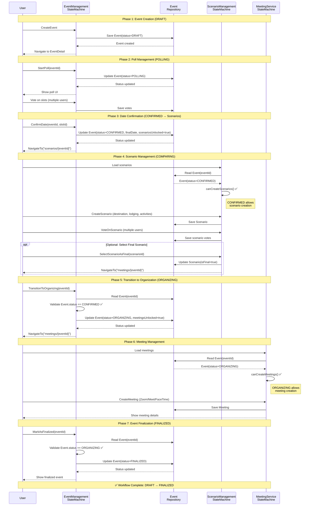
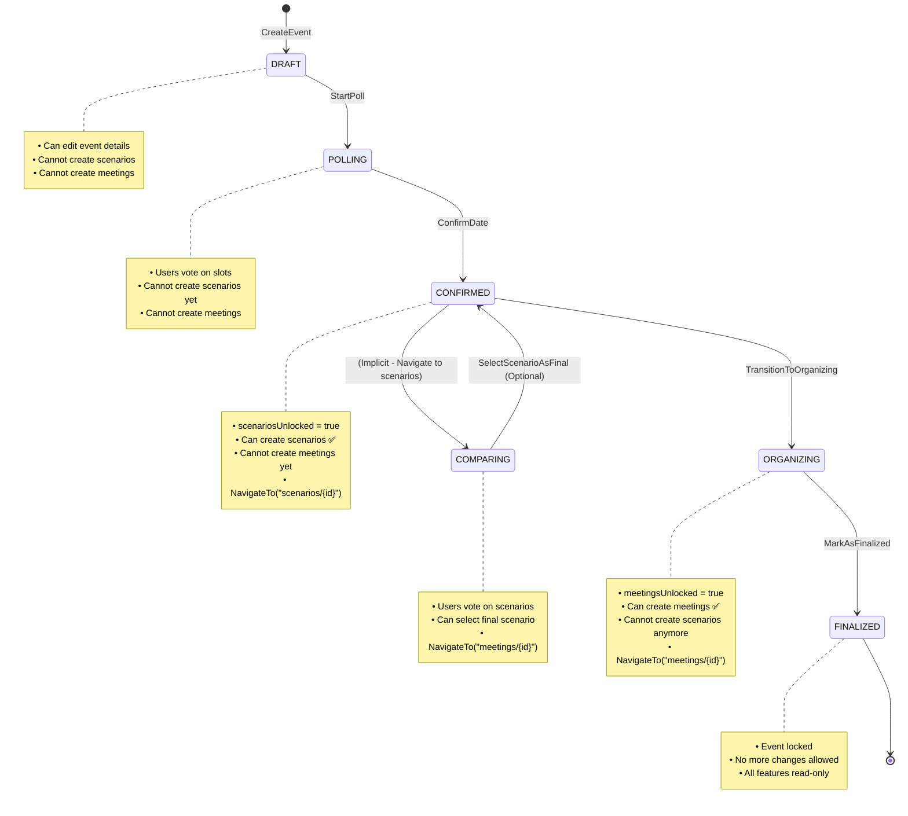
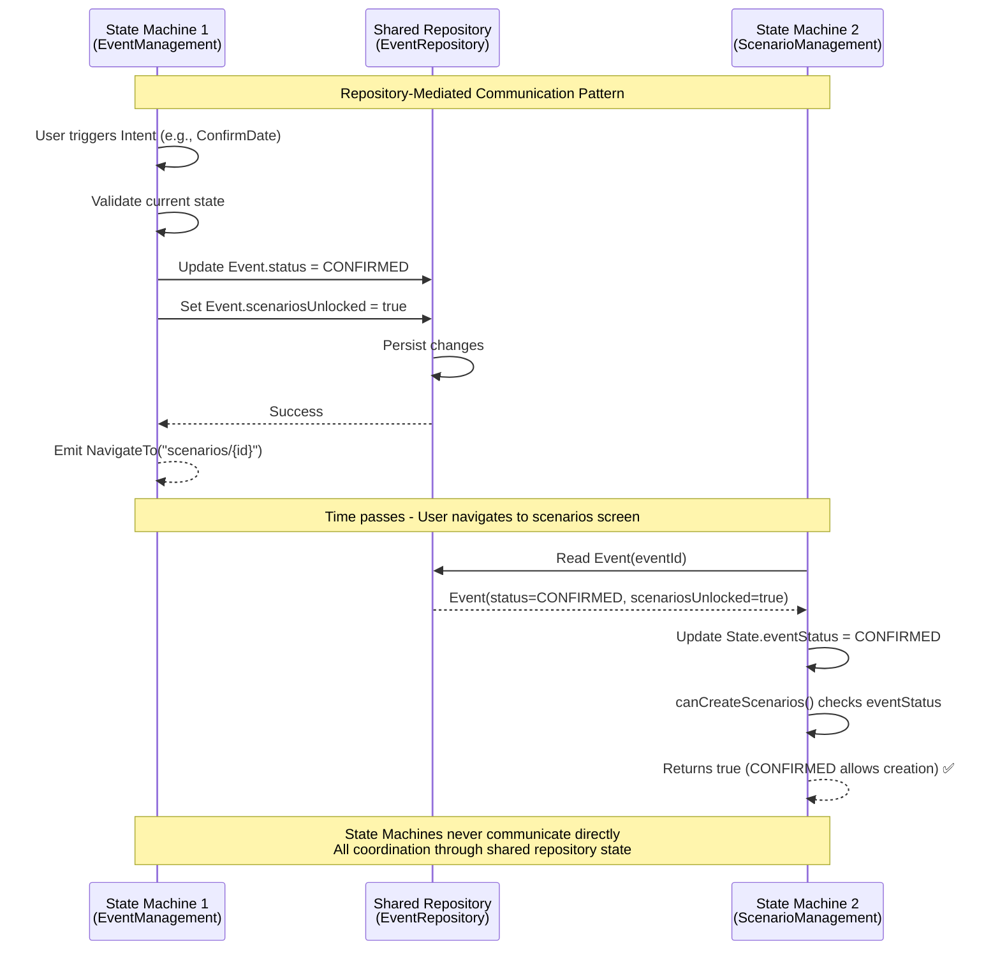
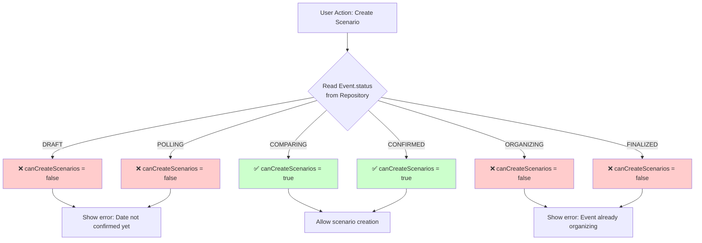
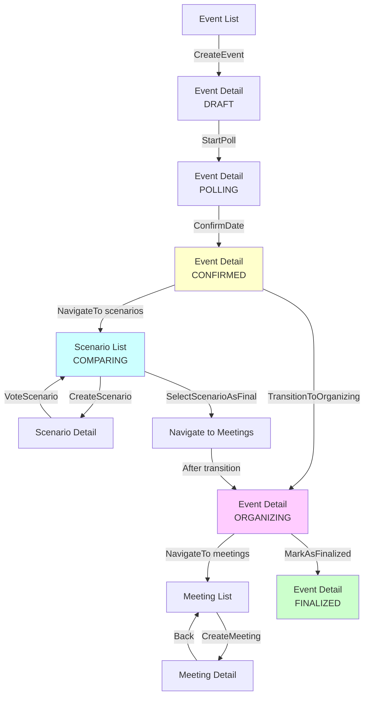
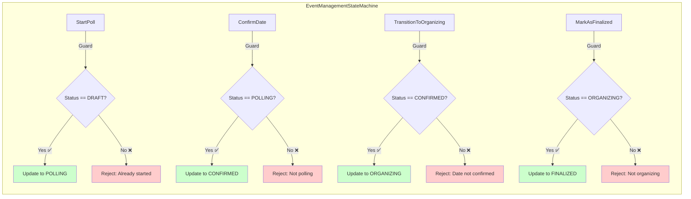
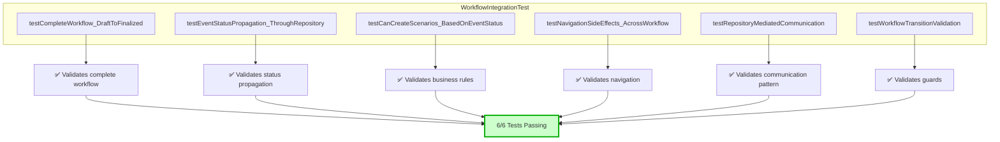

# Workflow Coordination Diagrams

> **Change ID**: `verify-statemachine-workflow`  
> **Phase**: 7 - Documentation  
> **Date**: 2025-12-31

---

## Overview

This document provides comprehensive visual documentation of the workflow coordination between state machines in Wakeve, demonstrating how EventManagementStateMachine, ScenarioManagementStateMachine, and MeetingServiceStateMachine coordinate through repository-mediated communication.

---

## Complete Workflow Sequence Diagram



---

## State Transition Diagram



---

## Repository-Mediated Communication Pattern



---

## Business Rule Enforcement



---

## Navigation Flow



---

## Event Status Guards



---

## Integration Test Coverage



---

## Key Architectural Patterns

### 1. Repository-Mediated Communication

**Pattern**: State machines communicate indirectly through shared repository state.

```kotlin
// State Machine 1: Updates shared state
eventStateMachine.dispatch(Intent.StartPoll("event-1"))
// → Repository: Event.status = POLLING

// State Machine 2: Reads shared state
val event = eventRepository.getEvent("event-1")
val canCreate = when (event?.status) {
    EventStatus.CONFIRMED, EventStatus.COMPARING -> true
    else -> false
}
```

**Benefits**:
- ✅ Loose coupling between state machines
- ✅ Strong consistency through shared repository
- ✅ Simple testing (mock repository only)
- ✅ Clear source of truth (Event.status)

### 2. Navigation Side Effects

**Pattern**: State machines emit navigation side effects after status transitions.

```kotlin
// EventManagementStateMachine
handleConfirmDate(eventId, slotId) {
    // Update status
    repository.updateEvent(eventId, status = CONFIRMED, finalDate = date)
    
    // Emit navigation
    emitSideEffect(NavigateTo("scenarios/$eventId"))
}
```

**Benefits**:
- ✅ Decoupled UI navigation from business logic
- ✅ Testable navigation flows
- ✅ Flexible UI implementation (Compose/SwiftUI)

### 3. Guard Pattern

**Pattern**: Validate EventStatus before executing state transitions.

```kotlin
// Example guard in ConfirmDate handler
if (event.status != EventStatus.POLLING) {
    emitSideEffect(ShowError("Cannot confirm date: event not in polling phase"))
    return
}

// Proceed with transition
repository.updateEvent(eventId, status = CONFIRMED)
```

**Benefits**:
- ✅ Prevents invalid state transitions
- ✅ Clear error messages for users
- ✅ Maintains state machine integrity

---

## Workflow Phases Summary

| Phase | EventStatus | Scenarios Allowed | Meetings Allowed | Navigation Trigger |
|-------|-------------|-------------------|------------------|--------------------|
| 1. Creation | DRAFT | ❌ | ❌ | - |
| 2. Polling | POLLING | ❌ | ❌ | StartPoll |
| 3. Date Confirmed | CONFIRMED | ✅ | ❌ | ConfirmDate → scenarios |
| 4. Scenario Voting | COMPARING | ✅ | ❌ | (implicit) |
| 5. Organization | ORGANIZING | ❌ | ✅ | TransitionToOrganizing → meetings |
| 6. Finalized | FINALIZED | ❌ | ❌ | MarkAsFinalized |

---

## Testing Strategy

### Unit Tests (EventManagementStateMachineTest)
- Test individual Intent handlers
- Validate status transitions
- Test guards and error cases
- **Coverage**: 13 tests, 100% passing

### Integration Tests (WorkflowIntegrationTest)
- Test cross-state-machine coordination
- Validate repository-mediated communication
- Test complete workflow (DRAFT → FINALIZED)
- Test business rule enforcement
- **Coverage**: 6 tests, 100% passing

---

## References

- **AUDIT.md**: Initial workflow analysis and gap identification
- **PHASE3_IMPLEMENTATION_COMPLETE.md**: Intent handler implementations
- **PHASE4_TESTING_COMPLETE.md**: Unit test details
- **PHASE5_INTEGRATION_COMPLETE.md**: Integration test validation
- **Contract Files**:
  - `EventManagementContract.kt`
  - `ScenarioManagementContract.kt`
  - `MeetingManagementContract.kt`
- **State Machine Files**:
  - `EventManagementStateMachine.kt`
  - `ScenarioManagementStateMachine.kt`

---

**Diagrams Complete**: ✅  
**Pattern Documentation**: ✅  
**Test Coverage**: 6/6 integration + 13/13 unit tests passing  
**Production Ready**: ✅
