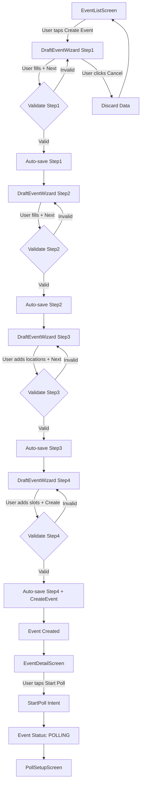

# DRAFT Workflow - Diagrammes

## Diagramme de Séquence - Création DRAFT

```
┌─────────────┐      ┌─────────────┐      ┌──────────────┐      ┌──────────────┐
│    User     │      │  UI Wizard   │      │State Machine  │      │  Repository   │
└──────┬──────┘      └──────┬──────┘      └──────┬───────┘      └──────┬───────┘
       │                    │                    │                     │
       │ Start Creation    │                    │                     │
       │──────────────────>│                    │                     │
       │                    │                    │                     │
       │ Fill Step 1       │                    │                     │
       │──────────────────>│                    │                     │
       │                    │                    │                     │
       │ Click "Next"      │                    │                     │
       │──────────────────>│                    │                     │
       │                    │                    │                     │
       │                    │ UpdateDraftEvent  │                     │
       │                    │───────────────────>│                     │
       │                    │                    │                     │
       │                    │                    │ update(event)         │
       │                    │                    │─────────────────────>│
       │                    │                    │                     │
       │                    │                    │◄────────────────────┤
       │                    │ Auto-save OK     │                     │
       │                    │<───────────────────│                     │
       │                    │                    │                     │
       │ Show Step 2        │                    │                     │
       │<───────────────────│                    │                     │
       │                    │                    │                     │
       │ Fill Step 2       │                    │                     │
       │──────────────────>│                    │                     │
       │                    │                    │                     │
       │ ... (repeat for steps 3-4)           │                     │
       │                    │                    │                     │
       │ Click "Create"    │                    │                     │
       │──────────────────>│                    │                     │
       │                    │                    │                     │
       │                    │ CreateEvent       │                     │
       │                    │───────────────────>│                     │
       │                    │                    │                     │
       │                    │                    │ insert(event)         │
       │                    │                    │─────────────────────>│
       │                    │                    │                     │
       │                    │                    │◄────────────────────┤
       │                    │ Event Created     │                     │
       │                    │<───────────────────│                     │
       │                    │                    │                     │
       │                    │ NavigateTo("detail/{id}")             │
       │                    │<───────────────────│                     │
       │                    │                    │                     │
       │ Navigate to Detail │                    │                     │
       │<───────────────────│                    │                     │
       │                    │                    │                     │
```

## Diagramme de Flux - Navigation DRAFT



## Diagramme d'États - Workflow DRAFT

```
┌─────────────────────────────────────────────────────────────────────┐
│                      Event Status: DRAFT                          │
├─────────────────────────────────────────────────────────────────────┤
│                                                                     │
│   ┌─────────────────────────────────────────────────────────────┐   │
│   │              WIZARD STEP STATE MACHINE                      │   │
│   ├─────────────────────────────────────────────────────────────┤   │
│   │                                                             │   │
│   │  ┌──────────┐     ┌──────────┐     ┌──────────┐         │   │
│   │  │  STEP 1  │────>│  STEP 2  │────>│  STEP 3  │         │   │
│   │  │Basic Info │     │Particpts │     │Locations │         │   │
│   │  └────┬─────┘     └────┬─────┘     └────┬─────┘         │   │
│   │       │                  │                  │                 │   │
│   │       │ Valid            │ Valid            │ Valid          │   │
│   │       │ Auto-save        │ Auto-save        │ Auto-save      │   │
│   │       │                  │                  │                 │   │
│   │       └──────────────────┴──────────────────┘                 │   │
│   │                           │                                 │   │
│   │                           ▼                                 │   │
│   │                    ┌──────────┐                            │   │
│   │                    │  STEP 4  │                            │   │
│   │                    │Time Slots│                            │   │
│   │                    └────┬─────┘                            │   │
│   │                         │                                   │   │
│   │                         │ Valid + Create                     │   │
│   │                         ▼                                   │   │
│   │                    ┌──────────────┐                        │   │
│   │                    │ EVENT CREATED│                        │   │
│   │                    │ NavigateTo   │                        │   │
│   │                    └──────────────┘                        │   │
│   │                                                             │   │
│   └─────────────────────────────────────────────────────────────┘   │
│                                                                     │
└─────────────────────────────────────────────────────────────────────┘
```

## Diagramme de Flux d'Erreur

```
┌─────────────┐
│  User       │
└──────┬──────┘
       │
       │ Fill Step with Invalid Data
       │
       ▼
┌─────────────┐
│  UI Wizard  │
└──────┬──────┘
       │
       │ Trigger Validation
       │
       ▼
┌─────────────────────────────────────┐
│  Validation Logic                 │
│  - title.isEmpty()?              │
│  - description.isEmpty()?         │
│  - (maxParticipants < min)?       │
│  - timeSlots.isEmpty()?          │
└──────┬──────────────────────────┘
       │
       │ Invalid
       │
       ├─────────────────────────────┐
       │                           │
       ▼                           ▼
┌─────────────┐           ┌─────────────┐
│ Show Error  │           │ Disable     │
│ (Toast)     │           │ Next Button │
└──────┬──────┘           └─────────────┘
       │
       ▼
┌─────────────┐
│ User fixes  │
│ the error   │
└──────┬──────┘
       │
       │ Retry Validation
       │
       ▼
┌─────────────┐
│ Valid →     │
│ Enable Next │
└─────────────┘
```

## Mapping Intents - UI ↔ State Machine

| UI Component | User Action | Intent Dispatched | Side Effect |
|-------------|-------------|-------------------|-------------|
| DraftEventWizard (Step 1) | Fill & Click Next | `UpdateDraftEvent` | Auto-save + NavigateTo Step 2 |
| DraftEventWizard (Step 2) | Fill & Click Next | `UpdateDraftEvent` | Auto-save + NavigateTo Step 3 |
| DraftEventWizard (Step 3) | Add Location | `AddPotentialLocation` | Auto-save |
| DraftEventWizard (Step 3) | Remove Location | `RemovePotentialLocation` | Auto-save |
| DraftEventWizard (Step 3) | Click Next | (optional auto-save) | NavigateTo Step 4 |
| DraftEventWizard (Step 4) | Add TimeSlot | `AddTimeSlot` | Auto-save |
| DraftEventWizard (Step 4) | Remove TimeSlot | `RemoveTimeSlot` | Auto-save |
| DraftEventWizard (Step 4) | Click Create | `CreateEvent` | NavigateTo("detail/{id}") |
| DraftEventWizard | Click Cancel | - | NavigateBack |
