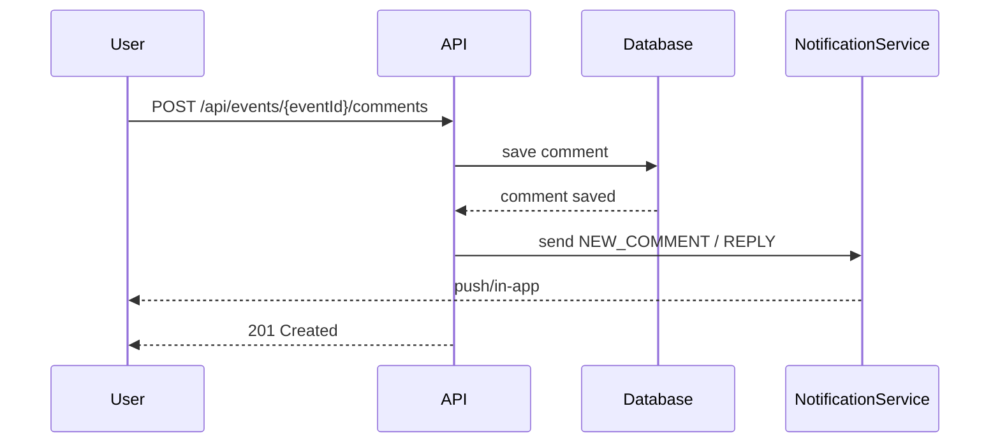

# Spécification: Collaboration Management

## A. Vue d'ensemble

### Description
La fonctionnalité de *collaboration* (système de commentaires) permet aux participants d'un événement Wakeve de communiquer, débattre et organiser les informations directement liées aux différentes sections d'un événement (scénarios, budget, logistique, repas, transport, équipements, activités, etc.). Le système supporte les threads, la modération, les notifications et les statistiques d'engagement.

### Cas d'usage principaux

- Discussion synchrone/asynchrone autour d'un scénario proposé
- Retour sur le budget estimé et discussion des postes de dépense
- Coordination logistique (transport, hébergement, repas)
- Questions/réponses entre participants et organisateur
- Modération des contenus et signalement

### Avantages pour les utilisateurs

- Centralisation des échanges liés à un événement
- Traçabilité des décisions (historique et édition)
- Notifications ciblées (réponse directe, mention, nouvelle discussion)
- Mesures d'engagement (statistiques pour l'organisateur)
- Contrôle fin des permissions (auteur vs organisateur vs admin)

---

## B. Modèles de données

> Tous les modèles sont définis en langage agnostique (JSON/Kotlin) pour faciliter l'implémentation multiplateforme.

### Comment

| Champ | Type | Description |
|-------|------|-------------|
| `id` | string (UUID) | Identifiant unique du commentaire |
| `eventId` | string (UUID) | Identifiant de l'événement associé |
| `section` | string (CommentSection) | Section de l'événement (ex: BUDGET, SCENARIO...) |
| `sectionItemId` | string? | Identifiant optionnel d'un item dans la section (ex: scenarioId) |
| `authorId` | string (UUID) | ID de l'auteur |
| `authorName` | string | Nom d'affichage de l'auteur |
| `content` | string | Contenu Markdown/texte du commentaire (max 2000 caractères) |
| `metadata` | object? | Métadonnées libres (réactions, attachments refs) |
| `parentCommentId` | string? | ID du commentaire parent si réponse |
| `createdAt` | string (ISO8601) | Date de création |
| `updatedAt` | string? (ISO8601) | Date de dernière modification |
| `isEdited` | boolean | Indique si le commentaire a été édité |
| `isDeleted` | boolean | Flag soft-delete (true si supprimé) |
| `replyCount` | integer | Nombre direct de réponses |
| `reactionCount` | object | Map des réactions et leurs comptes (ex: {"like": 3}) |

Kotlin exemple:

```kotlin
data class Comment(
    val id: String,
    val eventId: String,
    val section: CommentSection,
    val sectionItemId: String?,
    val authorId: String,
    val authorName: String,
    val content: String,
    val metadata: Map<String, String>?,
    val parentCommentId: String?,
    val createdAt: String,
    val updatedAt: String?,
    val isEdited: Boolean = false,
    val isDeleted: Boolean = false,
    val replyCount: Int = 0,
    val reactionCount: Map<String, Int> = emptyMap()
)
```

---

### CommentSection (Enum)

Valeurs supportées:

- `GENERAL` - Discussions générales
- `SCENARIO` - Scénarios de voyage / dates
- `POLL` - Sondages et votes
- `TRANSPORT` - Transport et trajets
- `ACCOMMODATION` - Hébergement
- `MEAL` - Repas / restauration
- `EQUIPMENT` - Équipements
- `ACTIVITY` - Activités
- `BUDGET` - Budget & coûts
- `OTHER` - Autres

Kotlin:

```kotlin
enum class CommentSection { GENERAL, SCENARIO, POLL, TRANSPORT, ACCOMMODATION, MEAL, EQUIPMENT, ACTIVITY, BUDGET, OTHER }
```

---

### CommentRequest (création)

| Champ | Type | Obligatoire | Description |
|-------|------|------------|-------------|
| `eventId` | string | oui | ID de l'événement |
| `section` | string | oui | Voir `CommentSection` |
| `sectionItemId` | string | non | ID d'un item spécifique dans la section |
| `content` | string | oui | Contenu du commentaire (max 2000) |
| `parentCommentId` | string | non | Pour les réponses |
| `metadata` | object | non | Données complémentaires (attachments, tags) |

Exemple JSON:

```json
{
  "eventId": "event-1",
  "section": "BUDGET",
  "content": "Je propose de réduire la location de 10%",
  "parentCommentId": null
}
```

---

### CommentUpdateRequest (mise à jour)

| Champ | Type | Obligatoire | Description |
|-------|------|------------|-------------|
| `content` | string | oui | Nouveau contenu |
| `metadata` | object | non | Mise à jour des métadonnées |

Exemple JSON:

```json
{
  "content": "Correction: je propose de réduire la location de 15%"
}
```

---

### CommentThread

Structure retournée lorsque `threaded=true`.

```json
{
  "id": "comment-1",
  "comment": { /* comment object */ },
  "replies": [ /* list of CommentThread */ ]
}
```

Attributs:
- `id` : id du commentaire racine
- `comment` : objet `Comment`
- `replies` : liste récursive de `CommentThread`

---

### CommentStatistics

Statistiques agrégées pour un événement ou une section.

| Champ | Type | Description |
|-------|------|-------------|
| `eventId` | string | ID de l'événement |
| `totalComments` | integer | Nombre total de commentaires (hors soft-deleted) |
| `commentsBySection` | object | Map section -> count |
| `averageRepliesPerComment` | float | Moyenne des réponses |
| `topContributors` | [CommentContributor] | Liste des meilleurs contributeurs |
| `activeParticipants` | integer | Nombre d'auteurs uniques actifs sur la période |

Exemple JSON:

```json
{
  "eventId": "event-1",
  "totalComments": 42,
  "commentsBySection": { "BUDGET": 12, "SCENARIO": 8 },
  "averageRepliesPerComment": 1.6,
  "topContributors": [ /* ... */ ],
  "activeParticipants": 18
}
```

---

### CommentContributor

| Champ | Type | Description |
|-------|------|-------------|
| `userId` | string | ID utilisateur |
| `userName` | string | Nom affiché |
| `commentCount` | integer | Nombre de commentaires |
| `replyCount` | integer | Nombre de réponses |
| `lastActiveAt` | string | ISO8601 |

---

### ParticipantActivity

Activité détaillée par participant (par période).

| Champ | Type | Description |
|-------|------|-------------|
| `userId` | string | ID utilisateur |
| `userName` | string | Nom affiché |
| `comments` | [Comment] | Liste des commentaires récents |
| `reactions` | object | Map reaction -> count |
| `lastActiveAt` | string | ISO8601 |

---

## C. API REST

> Base path: `/api/events/{eventId}/comments`

### Principes
- Tous les endpoints requièrent authentification (token Bearer OAuth).
- Contrôles d'autorisation: 
  - Création: tout participant authentifié peut poster si l'événement autorise la discussion.
  - Modification/Suppression: seulement l'auteur ou un utilisateur avec rôle `ORGANIZER`/`ADMIN`.
  - Lecture: tout participant invité à l'événement peut lire les commentaires.
- Pagination: `limit` / `offset` (ou `cursor` pour implémentation future).
- Paramètre `threaded` (default true) renvoie une structure hiérarchique.

### Endpoints principaux

| Endpoint | Méthode | Description |
|----------|--------:|-------------|
| GET /api/events/{eventId}/comments | GET | Récupère les commentaires d'un événement (filtrage & pagination) |
| POST /api/events/{eventId}/comments | POST | Crée un nouveau commentaire |
| GET /api/events/{eventId}/comments/{commentId} | GET | Récupère un commentaire unique (avec thread contextuel) |
| PUT /api/events/{eventId}/comments/{commentId} | PUT | Met à jour un commentaire (auteur uniquement) |
| DELETE /api/events/{eventId}/comments/{commentId} | DELETE | Supprime (soft-delete) un commentaire |
| GET /api/events/{eventId}/comments/stats | GET | Récupère les statistiques de commentaires |
| GET /api/events/{eventId}/comments/top-contributors | GET | Top contributeurs |
| POST /api/events/{eventId}/comments/{commentId}/reactions | POST | Ajouter/retirer une réaction |
| POST /api/events/{eventId}/comments/{commentId}/report | POST | Signaler un commentaire |

---

### Récupérer les commentaires d'un événement

**Endpoint**: `GET /api/events/{eventId}/comments`

**Description**: Récupère tous les commentaires d'un événement, avec support du filtrage par section, pagination et threading.

**Paramètres de chemin**:
- `eventId` (string, obligatoire): ID de l'événement

**Paramètres de requête**:
- `section` (string, optionnel): Filtrer par `CommentSection` (ex: BUDGET)
- `sectionItemId` (string, optionnel): Filtrer par item de section
- `threaded` (boolean, optionnel, défaut: `true`): Retourner la structure en threads
- `limit` (integer, optionnel, défaut: `20`)
- `offset` (integer, optionnel, défaut: `0`)
- `order` (string, optionnel, valeur: `newest|oldest|most_replied`, défaut `newest`)

**Réponse** (200 OK):

```json
{
  "comments": [ /* CommentThread | Comment list */ ],
  "totalCount": 15,
  "limit": 20,
  "offset": 0,
  "hasMore": true
}
```

**Erreurs**:
- `400 Bad Request` : Paramètres invalides
- `401 Unauthorized` : Token absent ou invalide
- `403 Forbidden` : Accès refusé à l'événement
- `404 Not Found` : Événement introuvable

---

### Créer un commentaire

**Endpoint**: `POST /api/events/{eventId}/comments`

**Description**: Crée un nouveau commentaire associé à `eventId`.

**Body** (application/json):

```json
{
  "section": "BUDGET",
  "sectionItemId": null,
  "content": "Je propose de réduire la location de 10%",
  "parentCommentId": null,
  "metadata": { "attachments": [] }
}
```

**Réponse** (201 Created):

```json
{
  "comment": { /* Objet Comment créé */ }
}
```

**Erreurs**:
- `400 Bad Request` : contenu absent ou trop long
- `401 Unauthorized` : non authentifié
- `403 Forbidden` : utilisateur non participant

**Comportement côté serveur**:
- Enregistrement en base
- Envoi de notifications aux intéressés (voir section Notifications)
- Mise à jour des statistiques

---

### Récupérer un commentaire unique

**Endpoint**: `GET /api/events/{eventId}/comments/{commentId}`

**Description**: Récupère un commentaire et son contexte (parent + réponses directes si demandé).

**Paramètres de requête**:
- `includeReplies` (boolean, défaut `false`)
- `repliesLimit` (int)

**Réponse** (200 OK):

```json
{
  "comment": { /* Comment */ },
  "parent": { /* parent Comment optional */ },
  "replies": [ /* list of Comment */ ]
}
```

---

### Mettre à jour un commentaire

**Endpoint**: `PUT /api/events/{eventId}/comments/{commentId}`

**Description**: Met à jour le contenu d'un commentaire. Seul l'auteur (ou admin/organizer) peut modifier.

**Body**:
```json
{ "content": "Nouveau contenu" }
```

**Réponse** (200 OK):
```json
{ "comment": { /* updated comment */ } }
```

**Erreurs**:
- `403 Forbidden` : modification interdite
- `409 Conflict` : mise à jour concurrente basée sur timestamps (optionnel)

---

### Supprimer un commentaire

**Endpoint**: `DELETE /api/events/{eventId}/comments/{commentId}`

**Description**: Soft-delete du commentaire (l'auteur ou un admin peut supprimer). Les réponses demeurent accessibles mais le contenu du commentaire supprimé est remplacé par un message standard si besoin.

**Réponse**: `204 No Content` sur succès

**Comportement**:
- Flag `isDeleted = true`
- Optionnel: anonymisation partielle du contenu

---

### Statistiques de commentaires

**Endpoint**: `GET /api/events/{eventId}/comments/stats`

**Paramètres**:
- `from` (ISO8601) optionnel
- `to` (ISO8601) optionnel

**Réponse** (200 OK):
```json
{ /* CommentStatistics */ }
```

---

### Top contributeurs

**Endpoint**: `GET /api/events/{eventId}/comments/top-contributors?limit=10`

**Réponse** (200 OK):
```json
{
  "topContributors": [ /* list of CommentContributor */ ]
}
```

---

### Réactions

**Endpoint**: `POST /api/events/{eventId}/comments/{commentId}/reactions`

**Body**:
```json
{ "reaction": "like", "action": "add" }
```

**Actions**: `add` | `remove`

**Réponse** (200 OK):
```json
{ "reactionCount": { "like": 5, "laugh": 1 } }
```

---

### Signaler un commentaire

**Endpoint**: `POST /api/events/{eventId}/comments/{commentId}/report`

**Body**:
```json
{ "reason": "inappropriate", "details": "contenu offensant" }
```

**Réponse**: `202 Accepted` (signalement reçu)

---

### Erreurs communes (format)

```json
{
  "error": {
    "code": "INVALID_ARGUMENT",
    "message": "Le champ 'content' est requis",
    "details": null
  }
}
```

---

## D. Cas d'usage (Scénarios)

### 1. Ajouter un commentaire sur un événement

- GIVEN utilisateur authentifié et participant
- WHEN il soumet `POST /api/events/{eventId}/comments` avec `section=BUDGET`
- THEN le commentaire est créé, persisté, et les participants concernés reçoivent une notification

### 2. Répondre à un commentaire

- GIVEN commentaire existant
- WHEN l'utilisateur spécifie `parentCommentId` à la création
- THEN le commentaire apparaît en réponse et le `replyCount` du parent est incrémenté

### 3. Filtrer les commentaires par section

- GIVEN de nombreux commentaires
- WHEN l'utilisateur appelle `GET` avec `?section=SCENARIO`
- THEN seuls les commentaires de la section SCENARIO sont renvoyés

### 4. Voir les statistiques de commentaires

- GIVEN un organisateur
- WHEN il appelle `/comments/stats?from=...&to=...`
- THEN il obtient `CommentStatistics` avec le top des contributeurs

### 5. Gérer les permissions (modifier/supprimer ses commentaires)

- GIVEN un auteur tente de modifier son commentaire
- WHEN il envoie `PUT` avec nouveau contenu
- THEN la modification est acceptée et `isEdited=true`. Si un autre utilisateur tente, `403 Forbidden` est renvoyé

---

## E. Notifications

### Types de notifications envoyées

1. `NEW_COMMENT` - Quand un commentaire est posté dans une section dont l'utilisateur suit l'activité
2. `REPLY_COMMENT` - Quand quelqu'un répond à un commentaire d'un utilisateur
3. `MENTION` - Quand un utilisateur est mentionné `@username`
4. `COMMENT_REACTION` - Quand quelqu'un réagit à votre commentaire
5. `COMMENT_REPORTED` - Notification interne aux modérateurs/admins

### Qui reçoit quoi

- `NEW_COMMENT`: Tous les participants ayant activé les notifications pour la section (par défaut: ON pour organisateur, participants ON)
- `REPLY_COMMENT`: Auteur du commentaire parent
- `MENTION`: Utilisateur mentionné
- `COMMENT_REACTION`: Auteur du commentaire
- `COMMENT_REPORTED`: Organisateurs + Moderators

### Quand les notifications sont envoyées

- Immédiatement à la création d'un commentaire / réaction / signalement
- Rappels (optionnels): digest quotidien si volumes élevés (feature future)

### Format des notifications (Push / Email / In-app)

Payload général (JSON):

```json
{
  "type": "REPLY_COMMENT",
  "title": "Nouvelle réponse à votre commentaire",
  "body": "Bob a répondu: \"Je suis d'accord\"",
  "eventId": "event-1",
  "commentId": "comment-2",
  "senderId": "user-2",
  "timestamp": "2025-12-26T11:00:00Z"
}
```

- Push: `title`, `body`, `data` avec `eventId` et `commentId`
- Email: Sujet = `title`, corps = `body` + lien vers l'événement
- In-app: Notification affichée dans la timeline de l'utilisateur

> **Note**: Respecter les préférences utilisateur (ne pas envoyer de push si désactivé).

---

## F. Best practices

- Limiter la taille des commentaires (2000 caractères) pour assurer lisibilité
- Encourager l'usage des sections pour contextualiser les discussions
- Éviter threads trop profonds (>5 niveaux) — recommander une nouvelle discussion si le sujet diverge
- Utiliser `@mentions` pour notifier directement les participants concernés
- Mettre en place des règles de modération (automatique et manuelle) pour signalement
- Supporter l'accessibilité: champs labellisés, focus management, texte lisible et contraste adapté
- Archivage: proposer export des commentaires (CSV/JSON) pour traçabilité

---

## Intégration & Références croisées

- Référence: `openspec/specs/event-organization/spec.md` (commentaires au niveau événement)
- Référence: `openspec/specs/scenario-management/spec.md` (commentaires sur scénarios)
- Référence: `openspec/specs/budget-management/spec.md` (commentaires budget)
- Endpoint backend: `server/src/main/kotlin/com/guyghost/wakeve/routes/CommentRoutes.kt`
- Modèles partagés: `shared/src/commonMain/kotlin/com/guyghost/wakeve/models/CommentModels.kt`

---

## Diagrammes (optionnels)

### Diagramme de séquence (création + notification)




---

## Migration & Compatibilité

- Les commentaires existants (v1) doivent être migrés vers le nouveau schéma en conservant `id`, `authorId`, `createdAt`, `content`, `parentCommentId`.
- Les anciennes références aux sections doivent être mappées aux valeurs `CommentSection`.

---

## Tests & Scénarios de vérification

- Tests unitaires pour création, modification, suppression, réaction
- Tests d'intégration: notifications, permissions, pagination
- Scénarios offline: création en mode offline, sync après reconnexion

---

## Tâches ouvertes / Améliorations futures

- Implémenter pagination cursors
- Digest quotidien configurable
- Recherche plein-texte sur commentaires
- Notation et badge pour top contributors


---

*Fin de la spécification technique*
